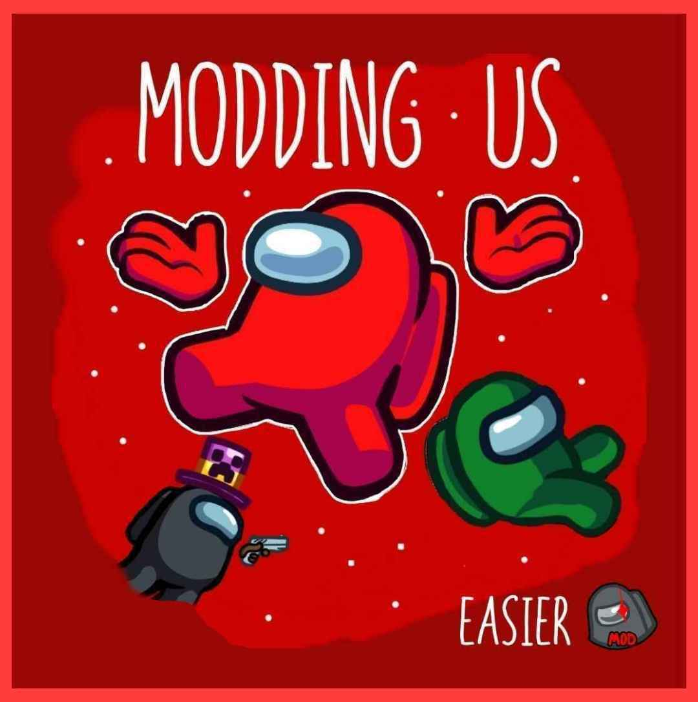

<h1 align="center">Modding Us</h1>

 

 

  
> ### Regarding this mod
>
> This mod is not affiliated with Among Us or Innersloth LLC, and the content contained therein is not endorsed or otherwise sponsored by Innersloth LLC. Portions of the materials contained herein are the property of Innersloth LLC.
 

## Features

### Custom maps
There is already some new maps, and partners are working on new maps that are coming soon!

### Custom roles
Integrated custom roles:
- Engineer (You can use vents)
- Sheriff (You need to shot the impostor)
- Medic (you can revive dead bodies)
- Jester (you will win if you get voted out)
- Pelican (you can eat crewmates)
- Dragger (you can drag bodies)
- Phantom (turn invisible)
- Shapeshifter (disguise yourself)

### External Mods Support (Done)

Modding Us has external mods support. so devs can easily create their own mods. [Mod Example](https://github.com/OvernightAU/Experimental-RoleExample)

## Installation

### PC (Using BlueStacks or LDPlayer):

1. **Download Modding Us APK** - Download the Modding Us APK from the [Releases section](https://github.com/OvernightAU/ModdingUs/releases).
2. **Install an Android Emulator** - Download and install **BlueStacks** or **LDPlayer** on your PC:
   - [Download BlueStacks](https://www.bluestacks.com)
   - [Download LDPlayer](https://www.ldplayer.net)
3. **Set Up the Emulator** - Open BlueStacks or LDPlayer and complete the initial setup (sign in with a Google account if required).
4. **Install Modding Us in the Emulator** - Drag and drop the downloaded Modding Us APK file into the emulator window or use the "Install APK" option in the emulator.
5. **Launch the Game** - Open Modding Us from the emulator's app drawer, and you should now be able play.

### Mobile (Android):

1. **Download Modding Us** - Download the Modding Us APK from the [Releases](https://github.com/OvernightAU/ModdingUs/releases).
2. **Allow Unknown Sources** - Make sure you have allowed installation from unknown sources in your device settings.
3. **Install Modding Us** - Install the APK you downloaded by following the on-screen instructions.
4. **Launch the Game** - Open Among Us from your app drawer, and you should now be able to play.

### Mobile (iOS)
iOS support is being developed!

## Community and Support

Join our community of Modding Us! If you encounter any issues, have suggestions, or want to share your experiences with the game, feel free to:

- Report issues on [GitHub Issues](https://github.com/Pietrodjaowjao/ModdingUs/issues) or Live Chat with a staff on the [Support Server](https://discord.gg/gacJbcyuMr)
- Join our Discord server: [Modding Us Discord](https://discord.gg/KRCSmSqgHz)

# Disclaimer and Distribution Notice for Third-Party Content
The map "Submerged" is not my creation, nor has it been officially added by any original dev. Therefore, don't expect any bug fixes from the original developers. However, if you're interested in an official distribution of Submerged and have a PC, you can find it at https://github.com/SubmergedAmongUs/Submerged.

In the event of a formal request for the removal of the "Submerged" map by developers associated with Submerged, I hereby agree to promptly remove said map. Additionally, if Innersloth, the creator of the base game, requests the cessation or temporary suspension of the game due to policy infractions, I will willingly adhere to their directives.

You can Contact us at: <a href="mailto:lorenzogamer398@gmail.com" style="color:blue;">lorenzogamer398@gmail.com</a>

# Modding Us Credits
- Project Lead and Developer
  - [Pietro](https://www.youtube.com/@pietro420)

- Artists
  - [PengunYT](https://www.youtube.com/channel/UCXLSJ5exAFpFEA-hqKBC3Bw)
  - [Sonrio](https://www.youtube.com/channel/UCq2mi9fit3RoJAJIP31iKAA)
  - [RSE](https://www.reddit.com/user/rotten_pennis)

- Submerged
  - [Main Page](https://github.com/SubmergedAmongUs/Submerged)
  - [Credits](https://github.com/SubmergedAmongUs/Submerged#credits)
  - [Releases](https://github.com/SubmergedAmongUs/Submerged/releases/)

- Testers
  - [ExyZero](https://www.youtube.com/@wtfexy_)
  - [Dxgamer](https://www.youtube.com/@Dxgamer7405)
  - SavaLava9

- Softwares
  - [AssetRipper](https://github.com/AssetRipper/AssetRipper) (decompiled Among Us)
  - [DnSpy](https://github.com/dnSpy/dnSpy) (decompiled some Submerged codes so i can have a idea of what i can do)
