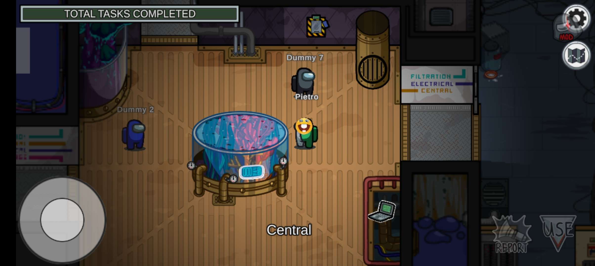

This project might be put on hold for a while because I'll be working on creating an easy mobile modding environment for Among Us. This environment will have a much simplier codebase to inject the hooks, so the modders can easily port their mods to mobile and pc. You can still go to [this link](https://github.com/OvernightAU/ModdingUs/releases/tag/Not-Release) to download, but please note that this repository may get archived for several reasons.
Some are legal reasons and also because i can't host online servers rn lmao.
<!--
## Features

### Submerged Map - Dive into the Depths!

Submerged is a mod for Among Us which adds a new map into the game. And i added it to my mod.

### Ai testing

Modding Us includes a map called backrooms, that is progammed to track all players and kill them

### Submerged Tasks

It includes almost all tasks of Submerged!

### External Mods Support (In Development)

Modding Us is will have a external mods supports, that will let you create and download mods that adds new roles, maps, mechanics, and much more.

## Installation

### PC (For now unavaiable, sorry):

1. **Download Modding Us** - Get the latest version of Modding Us from the Releases section on GitHub.
5. **Launch the Game** - Start Modding Us.

### Mobile (Android):

1. **Download Modding Us** - Download the Modding Us APK from the [Releases](https://github.com/OvernightAU/ModdingUs/releases).
2. **Allow Unknown Sources** - Make sure you have allowed installation from unknown sources in your device settings.
3. **Install Modding Us** - Install the APK you downloaded by following the on-screen instructions.
4. **Launch the Game** - Open Among Us from your app drawer, and you should now see the Modding Us content.

### Mobile (iOS)
iOS support is being developed!

## Community and Support

Join our community of Modding Us! If you encounter any issues, have suggestions, or want to share your experiences with the game, feel free to:

- Report issues on [GitHub Issues](https://github.com/Pietrodjaowjao/ModdingUs/issues) or Live Chat with a staff on the [Support Server](https://discord.gg/gacJbcyuMr)
- Join our Discord server: [Modding Us Discord](https://discord.gg/KRCSmSqgHz)

This is not affiliated with Among Us or Innersloth LLC, and the content contained therein is not endorsed or otherwise sponsored by Innersloth LLC. Portions of the materials contained herein are property of Innersloth LLC. © Innersloth LLC.
-->
# Disclaimer and Distribution Notice for Third-Party Content
This project is not affiliated with Among Us or Innersloth LLC, and the content contained therein is not endorsed or otherwise sponsored by Innersloth LLC. Portions of the materials contained herein are property of Innersloth LLC. © Innersloth LLC.

The map "Submerged" is not my creation, nor has it been officially added by any original dev. Therefore, don't expect any bug fixes from the original developers. However, if you're interested in an official distribution of Submerged and have a PC, you can find it at https://github.com/SubmergedAmongUs/Submerged.

In the event of a formal request for the removal of the "Submerged" map by developers associated with Submerged, I hereby agree to promptly remove said map. Additionally, if Innersloth, the creator of the base game, requests the cessation or temporary suspension of the game due to policy infractions, I will willingly adhere to their directives.

You can Contact us at: <a href="mailto:drycanova@gmail.com" style="color:blue;">drycanova@gmail.com</a>

# Modding Us Credits
- Project Lead and Developer
  - [Pietro](https://www.youtube.com/@pietro420)

- Artists
  - [PengunYT](https://www.youtube.com/channel/UCXLSJ5exAFpFEA-hqKBC3Bw)
  - [Sonrio](https://www.youtube.com/channel/UCq2mi9fit3RoJAJIP31iKAA)
  - RSE (Looks like he does not have any social media)

- Submerged
  - [Main Page](https://github.com/SubmergedAmongUs/Submerged)
  - [Credits](https://github.com/SubmergedAmongUs/Submerged#credits)
  - [Releases](https://github.com/SubmergedAmongUs/Submerged/releases/)

- Testers
  - [ExyZero](https://www.youtube.com/@wtfexy_)
  - [Dxgamer](https://www.youtube.com/@Dxgamer7405)
  - SavaLava9

- Softwares
  - [AssetRipper](https://github.com/AssetRipper/AssetRipper) (decompiled Among Us)
  - [DnSpy](https://github.com/dnSpy/dnSpy) (decompiled some Submerged codes so i can have a idea of what i can do)
